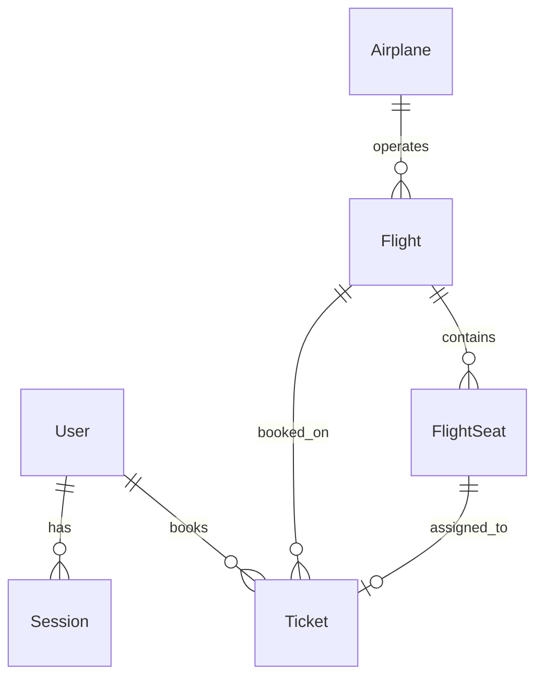

# FlyHigher Architecture & Database

> **The Rules** — Struktur data dan aturan main sistem.

---

## Directory Structure

```
booking-ticket/
├── prisma/
│   └── schema.prisma          # Database schema
├── src/
│   ├── app/
│   │   ├── (auth)/            # Auth pages (login, register)
│   │   ├── (home)/            # Customer-facing pages
│   │   │   ├── page.tsx       # Landing/Homepage
│   │   │   ├── available-flights/
│   │   │   ├── choose-seat/[id]/
│   │   │   ├── checkout/
│   │   │   ├── my-tickets/
│   │   │   ├── success-checkout/
│   │   │   └── about/
│   │   ├── dashboard/(home)/  # Admin dashboard
│   │   │   ├── airplanes/
│   │   │   ├── flights/
│   │   │   ├── tickets/
│   │   │   └── users/
│   │   ├── api/               # API routes
│   │   └── _components/       # Shared page components
│   ├── components/ui/         # Reusable UI components
│   ├── hooks/                 # Custom React hooks
│   ├── lib/                   # Utilities (auth, supabase, utils)
│   └── types/                 # TypeScript definitions
└── documentation/             # Documentation (YOU ARE HERE)
```

---

## File Organization Rules

### Page-Specific Components

```
page-folder/
├── page.tsx              # Main page
├── loading.tsx           # Loading skeleton
├── error.tsx             # Error boundary
├── _components/          # Page-specific components
│   ├── ComponentA.tsx
│   └── ComponentB.tsx
└── providers/            # Context providers
    └── SomeProvider.tsx
```

### Shared Components

```
src/components/
└── ui/                   # Reusable across pages
    ├── button.tsx        # Based on shadcn/ui
    ├── input.tsx
    └── ...
```

---

## Database Schema

### Connection

```env
DATABASE_URL="postgresql://..."
DIRECT_URL="postgresql://..."
```

### Enums

```typescript
enum RoleUser {
  CUSTOMER = "CUSTOMER"  // User biasa
  ADMIN = "ADMIN"        // Administrator
}

enum TypeSeat {
  ECONOMY = "ECONOMY"     // Kelas ekonomi
  BUSSINESS = "BUSSINESS" // Kelas bisnis
  FIRST = "FIRST"         // Kelas first class
}

enum StatusTicket {
  PENDING = "PENDING"   // Menunggu pembayaran
  SUCCESS = "SUCCESS"   // Pembayaran berhasil
  FAILED = "FAILED"     // Pembayaran gagal
}
```

### Tables

#### User

```prisma
model User {
  id       String    @id @default(cuid())
  name     String
  email    String    @unique
  password String    // hashed
  passport String?   // optional
  role     RoleUser  @default(CUSTOMER)

  tickets  Ticket[]
  sessions Session[]
}
```

#### Session

```prisma
model Session {
  id        String   @id
  userId    String
  expiresAt DateTime

  user User @relation(fields: [userId], references: [id])
}
```

#### Airplane

```prisma
model Airplane {
  id      String   @id @default(cuid())
  code    String   @default("ABC-123")
  name    String
  image   String   // URL gambar

  flights Flight[]
}
```

#### Flight

```prisma
model Flight {
  id                  String    @id @default(cuid())
  slug                String?
  planeId             String
  departureDate       DateTime
  departureCity       String
  departureCityCode   String
  destinationCity     String
  destinationCityCode String
  arrivalDate         DateTime
  price               Int

  plane   Airplane    @relation(fields: [planeId], references: [id])
  seats   FlightSeat[]
  tickets Ticket[]

  @@index([departureCityCode, destinationCityCode, departureDate])
  @@index([departureDate])
}
```

#### FlightSeat

```prisma
model FlightSeat {
  id         String   @id @default(cuid())
  flightId   String
  seatNumber String
  isBooked   Boolean  @default(false)
  type       TypeSeat @default(ECONOMY)

  flight Flight  @relation(fields: [flightId], references: [id])
  ticket Ticket?
}
```

#### Ticket

```prisma
model Ticket {
  id            String       @id @default(cuid())
  code          String       @unique
  slug          String?
  flightId      String
  customerId    String
  seatId        String       @unique
  bookingDate   DateTime     @default(now())
  price         BigInt
  status        StatusTicket @default(PENDING)
  tokenMidtrans String?

  flight   Flight     @relation(fields: [flightId], references: [id])
  customer User       @relation(fields: [customerId], references: [id])
  seat     FlightSeat @relation(fields: [seatId], references: [id])

  @@index([customerId])
  @@index([status])
  @@index([bookingDate])
}
```

### Entity Relationship Diagram



```
User 1──────N Session
  │
  └──1──────N Ticket N──────1 FlightSeat N──────1 Flight N──────1 Airplane
```

---

## State Management

### Server State (TanStack Query)

```typescript
import { useQuery, useMutation } from "@tanstack/react-query";
```

**Use Cases:** Flight search results, Ticket listings, User data

### Client State (React Context)

```typescript
// src/app/(home)/choose-seat/[id]/providers/SeatProvider.tsx
const SeatContext = createContext<SeatContextType>({...});
```

**Use Cases:** Seat selection state, Checkout data, UI state (modals, filters)

---

## Authentication Architecture

Using **Lucia Auth v3** with Prisma adapter:

```typescript
// src/lib/auth.ts
export const lucia = new Lucia(adapter, {
  sessionCookie: { ... },
  getUserAttributes: (attributes) => ({ ... })
});
```

### Auth Patterns

1. **Server Components** → Use `validateRequest()` from `lib/auth.ts`
2. **API Routes** → Use `lucia.createSession()`, `lucia.validateSession()`
3. **Client Components** → Fetch session via API or pass as prop

---

## URL State Management (Admin Dashboard)

### Pattern: Search Params for Filters

Admin pages menggunakan URL search params untuk menyimpan state filter, search, dan pagination.

```tsx
// Reading params in Server Component
export default async function AdminPage({
  searchParams,
}: {
  searchParams: { q?: string; status?: string; page?: string };
}) {
  const search = searchParams.q || "";
  const status = searchParams.status || "all";
  const page = parseInt(searchParams.page || "1");

  const data = await getData({ search, status, page });

  return <AdminTable data={data} />;
}
```

### Pattern: Client Component for URL Updates

```tsx
"use client";

import { useRouter, useSearchParams, usePathname } from "next/navigation";
import { useCallback } from "react";

export function useAdminFilters() {
  const router = useRouter();
  const pathname = usePathname();
  const searchParams = useSearchParams();

  const createQueryString = useCallback(
    (name: string, value: string) => {
      const params = new URLSearchParams(searchParams.toString());
      if (value) {
        params.set(name, value);
      } else {
        params.delete(name);
      }
      // Reset page when filter changes
      if (name !== "page") {
        params.set("page", "1");
      }
      return params.toString();
    },
    [searchParams]
  );

  const setFilter = (name: string, value: string) => {
    router.push(`${pathname}?${createQueryString(name, value)}`);
  };

  return { setFilter, searchParams };
}
```

### Admin Components Directory Structure

```
src/
├── components/
│   ├── admin/                    # Admin-specific components
│   │   ├── AdminSearchInput.tsx  # Debounced search with URL sync
│   │   ├── AdminFilterSelect.tsx # Filter dropdown with URL sync
│   │   ├── AdminPagination.tsx   # Page navigation
│   │   ├── AdminToolbar.tsx      # Wrapper for filters
│   │   └── ConfirmModal.tsx      # Delete confirmation
│   └── ui/                       # Generic UI components
│       └── data-table.tsx        # Enhanced with pagination props
└── app/
    └── dashboard/(home)/
        └── [entity]/
            ├── page.tsx          # Server component with searchParams
            ├── _components/
            │   └── Columns.tsx   # Table column definitions
            └── lib/
                ├── data.ts       # Data fetching with filters
                └── actions.ts    # Server actions (CRUD)
```

### Server Action Pattern with Revalidation

```typescript
"use server";

import { revalidatePath } from "next/cache";

export async function deleteItem(id: string) {
  try {
    await prisma.item.delete({ where: { id } });
    revalidatePath("/dashboard/items");
    return { success: true };
  } catch (error) {
    return { error: "Failed to delete" };
  }
}
```
